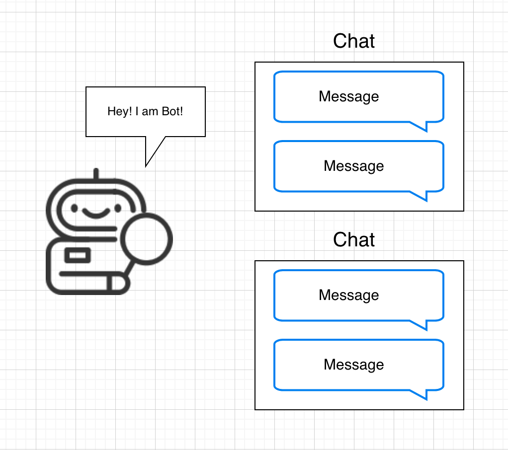
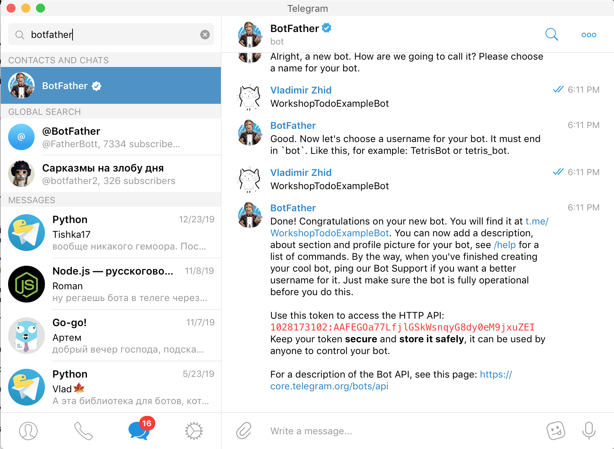
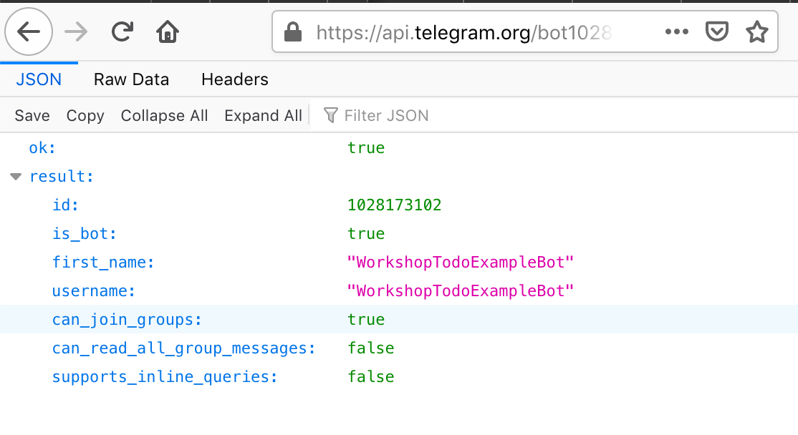

# Что такое эти боты?

Кому-то боты в мессенжерах могут показаться сложной штукой, в действительности же мы можем рассматривать бота как запрограммированного собеседника или участника чата. Еще проще будет изначально рассматривать бота как некий Веб-сервер который может получать сообщения и на них отвечать. В дальнейшем мы разберем более сложные конфигурации но первым нашим ботом будет примитивный `echo-бот`, задача которого отвечать тем-же сообщением которое он получил. Но прежде чем нам приступить к его написанию нам надо написать простой "Hello world!" на языке `python`.

# Создание Hello World проекта на Python.

И так.. у нас есть интерпретатор языка `python3`, для того чтобы стартануть проект нам потребуется сделать следующее:

1. Создать папку проекта
   Давайте в папке пользователя создадим директорию `mybot`, для этого выполним следующие команды:

   ```bash
   cd ~# переходим в директорию пользователя
   mkdir mybot # Создаем папку mybot
   cd mybot # Переходим в папку mybot
   ```

2. Установить инструмент `virtualenv` используя менеджер пакетов `pip`

   При разработке... допустим на NodeJs ваши зависимости проекта устанавливаются в директорию `node_modules`, в python по умолчанию немного по другому - все зависимости устанавливаются глобально, а это может привести к тому, что все ваши проекты будут шарить между собой одну версию пакета. Пакеты же имеют свойство обновляться и ломать обратную совместимость, для борьбы с подобным поведением мы будем испльзовать инструмент `virtualenv`. Начнем с того что установим его:

   ```bash
   pip install virtualenv
   # Но скорее всего, если вы на Linux, вы увидете сообщение о том, что вам не хватает прав для вызова подобной команды
   sudo pip install virtualenv # Вот так уже лучше
   ```

   Для того чтобы убедиться в том, что `virtualenv` установлен наберем следуещее:

   ```bash
   virtualenv --version
   ```

   Если версия вывелась - то все хорошо.
   После этого давайте уже создадим виртуальное окружение для проекта, находясь в директории проекта набираем следующее:

   ```bash
   virtualenv ./pyenv
   source ./.pyenv/bin/activate
   ```

   И снова! Если нет сообщений об ошибке - вы уже активировали виртуальное окружение.

3. Пишем скрипт, который выведет в консоле "Hello world!"

   Создаем файл `hello.py` с следующим содержанием:

   ```python
   print("Hello world!")
   ```

4. Запускаем это файл

   ```bash
   python3 ./hello.py
   ```

5. Радуемся надписи "Hello world!" в консоли

# Возвращаемся к ботам

Мы сейчас написали самый простой скрипт на `python` и скорее всего он для кого-то первый. Теперь давайте снова вернемся к разговору о ботах и перечислим сущности с которыми нам надо оперировать в ходе работы над ним.

- `Разговор` - Чат между двумя людьми.
  > Если мы будем говорить только про Telegram, то для него нет отдельной сущности `Разговор` в его терминологии все является чатами, просто бывают такие особенные, где только два участника.
- `Чат` - Комната в которой находятся люди и сообщения.
- `Сообщение` - Какая-то запись у которой скорее всего есть автор и информация о том в каком чате это сообщение находится.



Естественно, что сущностей намного больше.. `Изображения`, `Файлы`, `Аудио` и.т.д. Помимо всего этого эти сущности имеют достаточно большое кол-во полей. Со всеми сущностями мы можем ознакомиться по этой ссылке: [Telegram Bot API (Available Types)](https://core.telegram.org/bots/api#available-types). С типами/сущностями мы еще будем знакомиться, а пока попытаемся подумать как должен работать **echo-бот**, давайте пока перечислим основные шаги:

- Мы заведем с ботом разговор
- Он начнет получать от нас сообщения, бот будет знать кто ему написал и в каком чате это сообщение было написано.
- После получения сообщения бот будет отправлять ответное сообщение
  - С тем же текстом
  - В тот же чат от куда он сообщение получил

Надеюсь, что на этом этапе у вас уже сложилось впечатление о том что будет представлять из себя наша программа(_бот_).

# Регистрация бота

Для того чтобы написать бота нам надо быть зарегистрированными в телеге. А еще мы должны найти бота по имени `BotFather`.



Для того чтобы создать бота пишем "папаше": `/newbot`, после чего вы попадете с ним в диалог, где вы сообщите ему требуемую информацию. В конце вы получите сообщение об успешном создании бота и самое главное! - **Токен доступа к API**

> ⚠️Внимательно смотрите на то, что вам отвечает бот! Какие ошибки могут быть:
>
> - Вы неверно указали `username` бота, который должен быть **уникальным** и **заканчиваться на 'Bot'**

# Первый запрос к API

> За документацией по методам бежим по следующей ссылке: [Telegram Bot API (Available Methods)](https://core.telegram.org/bots/api#available-methods)

> Желательно чтобы вы делали запросы либо в браузере Firefox, либо в чтобы в вашем браузере было установленно расширения для красивого отображения JSON

Теперь у нас есть _токен_ а с ним мы можем делать запросы в апишку. Как делать запросы? Легко! Просто открываем браузер и пишем в адресной строке: `https://api.telegram.org/bot<YOUR_TOKEN>/getMe`.


> Что такое `getMe` в урле? Да! Это метов, а ссылка на список методов лежит выше👆

# Первое общение с нашим ботом

Мы с вами смогли сделать первый запрос к API, после этого нам следует попробовать пообщаться с ботом без написания нами кода для этого пройдемся по следующим шагам

1. Проходим по следующей ссылке в браузере: `https://api.telegram.org/bot<YOUR_TOKEN>/getUpdates`. Мы получим ответ но ниодного сообщения в нем не будет
2. Находим бота в Telegram
3. Начинаем с ним разговор и пишем `hello`
4. Повторяем первый шаг и уже что-то есть! Вы увидете примерно такой JSON:
   ```json
   {
     "ok": true,
     "result": [
       {
         "update_id": 403492974,
         "message": {
           "message_id": 3,
           "from": {
             "id": 197562409,
             "is_bot": false,
             "first_name": "*****",
             "last_name": "****",
             "username": "****",
             "language_code": "en"
           },
           "chat": {
             "id": 197562409,
             "first_name": "*****",
             "last_name": "*******",
             "username": "*******",
             "type": "private"
           },
           "date": 1580395346,
           "text": "hello"
         }
       }
     ]
   }
   ```
5. Давайте ответим на это сообщение, для этого отправляем примерно такой запрос: `https://api.telegram.org/bot<YOUR_TOKEN>/sendMessage?text=hi%20to%20you%20too&chat_id=<CHAT_ID ИЗ ПРОШЛОГО ОТВЕТА>&reply_to_message_id=<MESSAGE_ID ИЗ ПРОШЛОГО ЗАПРОСА>`

   Проделав все эти действия вы получите сообщение от бота с текстом `hi to you too`

   > На этом шаге мы используем метод API `sendMessage`, сразуже приложу ссылку на доку по этому методу: [sendMessage](https://core.telegram.org/bots/api#sendmessage)

# python-telegram-bot

Это пакет для языка `python`, который поможет нам взаимодействовать с API проще. Давайте установим его в наш проект(_виртуальное окружение_).

```bash
printenv VIRTUAL_ENV # убеждаемся, что мы все еще в виртуальном окружении
pip install python-telegram-bot # Устанавливаем пакет
```

> [Документация python-telegram-bot](https://python-telegram-bot.readthedocs.io)

Справедливо будет если мы скажем, что пакет разбит на 2 части:

- `telegram` - Предоставляет нам инструменты для вызова методов API и какие-то абстракции над типами апишки.
- `telegram.ext` - Уже более интересный модуль, потому что в нем находятся инструменты для роутинга сообщений и.т.д. Сейчас может быть не совсем понятно, но на практике станет яснее что я имел ввиду.

При написании нашего **echo-бота** мы заюзаем только первую часть библиотеки - `telegram`

# Echo-Bot

Давайте я сразу представлю вам финальный код **echo-бота**, но напишем мы его постепенно, вот только нам надо еще установить `python-telegram-bot`

```bash
pip install python-telegram-bot
```

А вот и сам код файлика `echo-bot.py`:

```python
import os
import logging
from dotenv import load_dotenv
from telegram import Bot

logging.basicConfig(level=logging.DEBUG)
logger = logging.getLogger("echo-bot")

max_id = 0


def main():
    global max_id
    load_dotenv()
    token = os.environ.get("ACCESS_TOKEN")
    bot = Bot(token)
    while True:
        logger.debug("start request")
        # Мы хотим получать только новые апдейты, поэтому мы завели переменную max_id
        # и вызываем метод getUpdates с параметром offset + timeout
        updates = bot.getUpdates(offset=max_id + 1, timeout=60)
        # В этой переменной мы сохраним максимальный id из полученных сейчас updates
        max_id_in_updates = 0
        for upd in updates:
            logger.debug(f"new update with id: {upd.update_id}")
            # Может быть так, что запустив бота мы получим апдейты
            # которые произошли во время его "спячки", мы их просто отфильтруем следующим условием
            # потому как max_id будет изменен только после обработки первых апдейтов
            if max_id != 0:
                bot.sendMessage(
                    upd.message.chat_id,
                    upd.message.text,
                    reply_to_message_id=upd.message.message_id,
                )
            max_id_in_updates = (
                upd.update_id
                if upd.update_id > max_id_in_updates
                else max_id_in_updates
            )
        if max_id_in_updates and max_id != max_id_in_updates:
            max_id = max_id_in_updates
            logger.debug(f"max id is changed to {max_id_in_updates}")


if __name__ == "__main__":
    main()
```

Как вы можете видеть, код кажется избыточным, плюс его не так удобно дополнять скорее всего нам хочется:

- Избавиться от бесконечного лупа
- Удобно добавлять обработчики... ведь добавлять логику сейчас сложно

Нужна какая-то "архитектура", а `telegram.ext` предоставляет нам очень удобные абстракции:

- `Updater` - Получает изменение/обновления и перенаправляет их диспетчеру (doc: [Updater](https://python-telegram-bot.readthedocs.io/en/latest/telegram.ext.updater.html#telegram.ext.Updater))
- `Dispatcher` - Полученные обновления он будет распределять по обработчикам (doc: [Dispatcher](https://python-telegram-bot.readthedocs.io/en/latest/telegram.ext.dispatcher.html))
- `Handler` - Обработчик обновлений, в диспетчер мы можем добавить несколько обработчиков под разные типы обновлений

  Вот некоторые подклассы `Handler`:

  - `MessageHandler` - Обрабатывает простые сообщения, которые прошли какой-то фильтр
  - `CommandHandler` - Обрабатывает команды (сообщения в виде: `/some_command`)

Давайте теперь перепишем нашу первую версию используя уже `telegram.ext`

```python
import os
import logging
from dotenv import load_dotenv
from telegram.ext import Updater, MessageHandler, CommandHandler, Filters

logging.basicConfig(level=logging.DEBUG)
logger = logging.getLogger("echo-bot")


def echo(update, context):
    context.bot.send_message(
        chat_id=update.effective_chat.id,
        text=update.message.text,
        reply_to_message_id=update.message.message_id,
    )


def start(update, context):
    context.bot.send_message(chat_id=update.effective_chat.id, text="Hello!")


def main():
    load_dotenv()
    token = os.environ.get("ACCESS_TOKEN")
    # Создаем экземпляр класса Updater
    updater = Updater(token, use_context=True)
    dispatcher = updater.dispatcher
    # Создаем 2 хендлера
    echo_handler = MessageHandler(Filters.text, echo)
    dispatcher.add_handler(echo_handler)
    start_handler = CommandHandler("start", start)
    dispatcher.add_handler(start_handler)
    # Начинаем запрашивать обновления от Telegram Bot API
    updater.start_polling()


if __name__ == "__main__":
    main()
```
> 🤔TODO: Если будет время допишу сюда разбор кода сверху, но вообще я сделаю это словестно на воркшопе

# TODO-Bot
Вот мы с вами уже что-то и умеем теперь давайте напишем __TODO-Bot__. Общаться мы с ним будет командами:
* `/addtodo Купить молоко` - Добавить задание "Купить молоко"
* `/ls` - Вывести список заданий c их статусами
* `/rm` - Удалить задание 
* `/done` - Пометить задание как выполненное

И давайте введем несколько условий:
* Бот при начале работы с ним должен вывести справочную информацию
* Если он не понимает нашу команду он должен нам об этом сообщить
